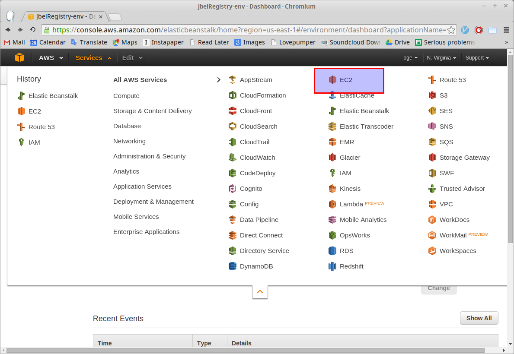
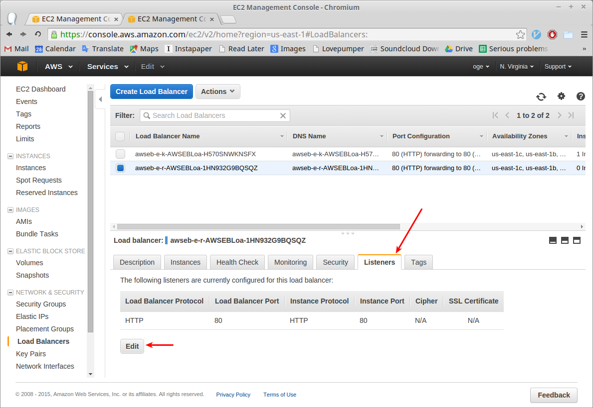
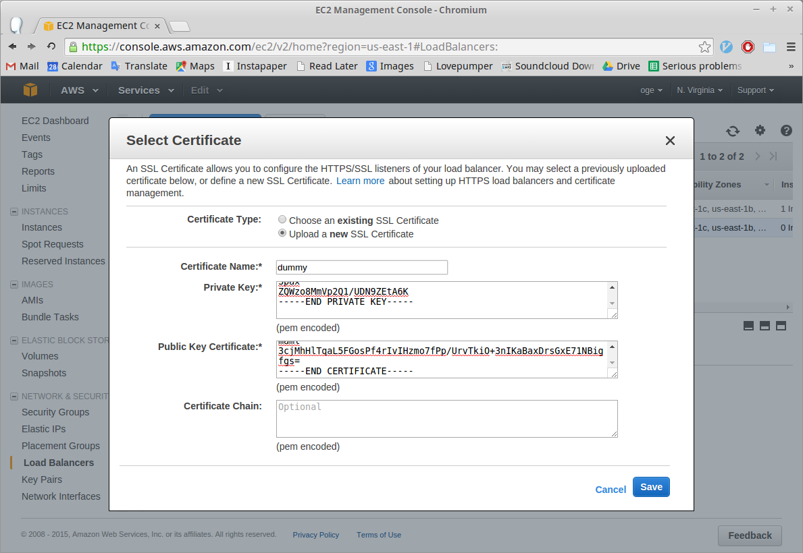
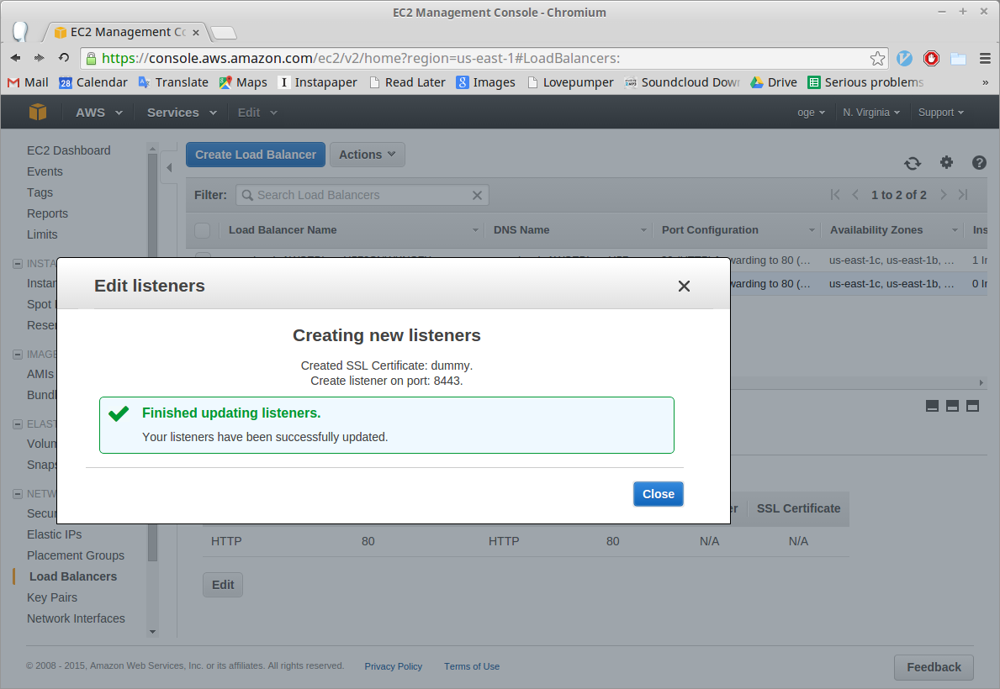
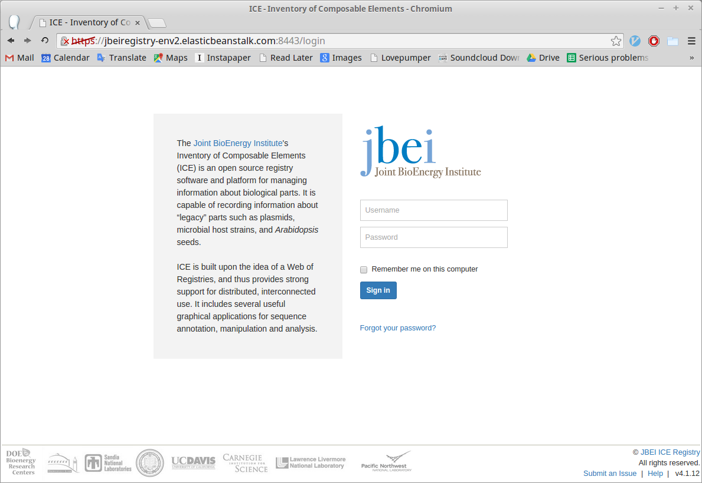

---
---

<!-- Don't edit the HTML version of this document. Edit the Markdown version then convert it to HTML -->

# Deploying ICE to AWS
The process takes about an hour to complete. You'll need

- An [Amazon Web Services (AWS) account](https://aws.amazon.com/)
- An [SSL certificate](https://www.namecheap.com/security/ssl-certificates/comodo.aspx)

We've included a dummy SSL certificate that you can use while testing out the intallation process. Note that using the dummy certificate will allow anyone in the world to view all your ICE repository data, in which case you might as well use the [public ICE registry](https://public-registry.jbei.org/login).

## Start the application
1. Log into your AWS account and go to the [Elastic Beanstalk site](https://console.aws.amazon.com/elasticbeanstalk/home). It is in the `Services` menu at the top of the page. 

1. Click `Create New Application` 

1. Select an `Application Name`, something like "jbei-registry". Click `Next`.

1. Click `Create web server` and click `Next` on the Permissions window that pops up.

1. In the `Environment Type` page, for `Predefined configuration` select `Tomcat`. For `Environment type` select `Load balancing, auto scaling`. Click `Next`. 

1. In the `Application Version` page, for `Source` upload the ICE source that you can get from the [JBEI Github repository](https://github.com/JBEI/ice/releases/download/4.1.12-beta/ice-4.1.12-beta.war) then click `Next`.

1. In the `Environment Information` page, ensure that the environment URL (one of the URLs at which your application will appear) is available, then click `Next`.

1. In the `Additional Resources` page, check the `Create an RDS DB Instance with this environment` box then click `Next`.

1. In the `Configuration Details` page, enter your email address if you want to be notified when the server is started, stopped, or goes offline. Click `Next`.

1. Click `Next` on the `Environment Tags` page.

1. In the `RDS Configuration` page, set `DB engine` to `postgres`. For the username, enter "tomcat", and then choose a secure password. Click `Next`.
    - Note that you may need the username and password to recover your registry's database in case of a catastrophic failure.
    - You should keep the default `Retention Setting` but note: 
    > Terminating your environment can permanently delete your Amazon RDS DB instance and all its data. By default, AWS Elastic Beanstalk saves a snapshot, which preserves your data but may incur backup storage charges

1. Click `Launch` on the `Review` page. It will take about 20 minutes for the application to fully launch.

## Configure the application
Before you can use the application you need to upload your SSL certificate to AWS.

1. Go to the `EC2` site via the `Services` menu at the top of the page. 

1. Click `Load Balancers` in the left-hand menu. 

1. Select your load balancer from the table and then click the `Listeners` tab in the pane that appears at the bottom of the page and then click the `Edit` button. 

1. In the `Edit listeners` modal window click `Add`. 
    1. In the new row that appears, under `Load Balancer Protocol`, choose `HTTPS (Secure HTTP)`. Change the `Load Balancer Port` to 8443. 
    1. Under `SSL Certificate` click `Change`. A `Select Certificate` modal window will pop up. For `Certificate Type` select `Upload a new SSL Certificate`.
        1. If you're using an SSL certificate that you bought, enter "server" for the certificate name. Otherwise enter "dummy". We'll assume that you're using a dummy certificate from here on out, but the instructions for setting up a real certificate are mostly the same.
        1. Paste your private key and public key certificate into the corresponding textboxes. Here is a [dummy private key](https://github.com/JBEI/ice/wiki/Dummy-SSL-private-key) and a [dummy public key certificate](https://github.com/JBEI/ice/wiki/Dummy-SSL-Public-Key-Certificate).
        1. If you have an optional certificate chain, enter it as well.
        1. Click `Save`. 
    1. Click `Save` again at the `Edit listeners` modal window, and when you see the success message, click `Close`. 

1. Now we need to tell the application to use the SSL certificate that we just uploaded. Go back to the `Elastic Beanstalk` site (Services > Elastic Beanstalk) and click on `Configuration` in the left-hand menu. 

1. Scroll down to the `Network Tier` section and click on the gear icon of the `Load Balancing` card. 

1. Change `Secure listener port` to 8443 and the `SSL Certificate ID` to the name of the certificate you uploaded. Click `Save`. 

1. Once Elastic Beanstalk is done updating the environment, we're ready to use the application.

1. Click the link next to the name of your application and environment. It will look like "jbeiregistry-env.elasticbeanstalk.com". 

1. Once you ignore the security warning (since you're using a dummy certificate), you should see the ICE login page. 

1. Enter the default username, "Administrator", and password, "Administrator". Change the password once you login since anyone on the Internet can now access your ICE registry.

1. And you're done. 

